# XCHU_SLAM

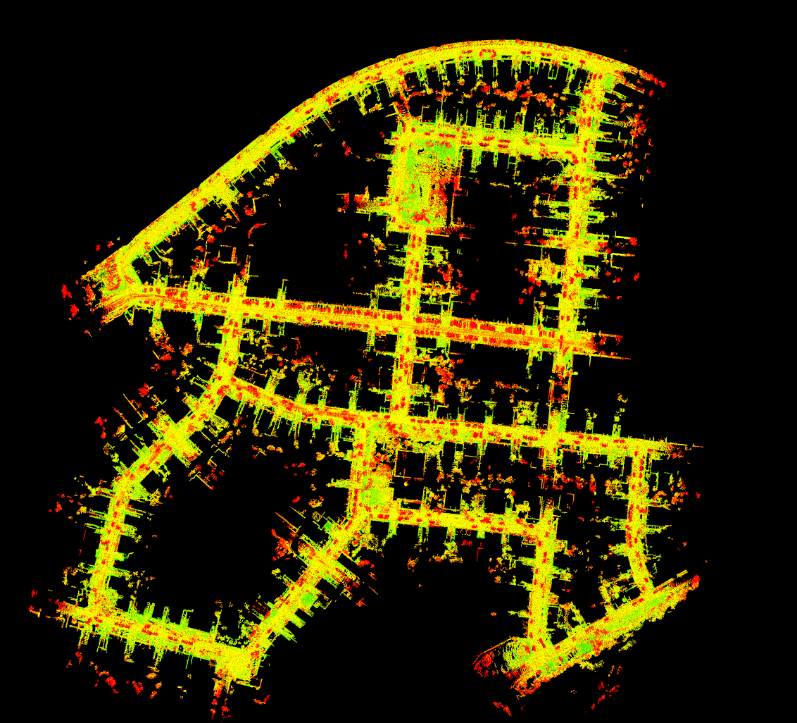

## Introduction

知乎：[](https://zhuanlan.zhihu.com/p/374042868)

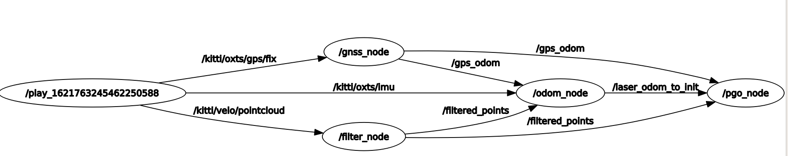

- filter_node：点云下采样，离群点去除，地面分割（法向量过滤+ransanc）。此部分代码简单，直接copy的hdl graph slam.

- odom_node：基于NDT的里程计，速度极快，匹配算法可选择ndt_omp、autoware_ndt、pcl_ndt等，可开启imu作为预测初值，imu频率过低，实际意义不大，同时未做点云去畸变处理，因为测试的kitti数据已去过畸变，**但此步骤在实际建图中非常影响精度**。

- 局部地图：采用两种策略的localmap, 实测方法2效果更好
  1.基于关键帧数量选取, 关键帧数量够则滑窗更新, 去除旧的加入新的
  2.基于距离选取关键帧, 基于localmap距离阈值刷新, 每个周期内localmap关键帧数量从1开始增加

- gps：

  1.在优化上，取协方差较小的GPS位置加入因子图中作为观测，其中包括x y z，高程z一般误差较大，但在kitti数据中比较好。

  （量化的实验结果有所提升，但全图一致性感觉一般，猜测问题来源于gps坐标转换到ENU系时其协方差和odom协方差尺度不一致，并且odom协方差设定死的，不可靠，**并且GPS和雷达之间缺乏标定**）。

  2.Gps坐标对齐，单独采用了一个gps_node的节点，添加了imu信息，进行了简单的数据拼接，用于odom中的初始化。

- 回环检测：三种方法，2中存在误检和漏检情况，3表示一般，对于建图精度未有太大提升，但漏检的情况要少很多。

  1.传统的邻域距离搜索+ICP匹配。

  2.基于scan context的回环检测。
  
  3.基于Intensity scan context的回环检测。
  
  下图中，蓝色表示因子图中的位姿节点，红色线段表示回环约束边，绿色线段表示里程计相对位姿约束。
  
  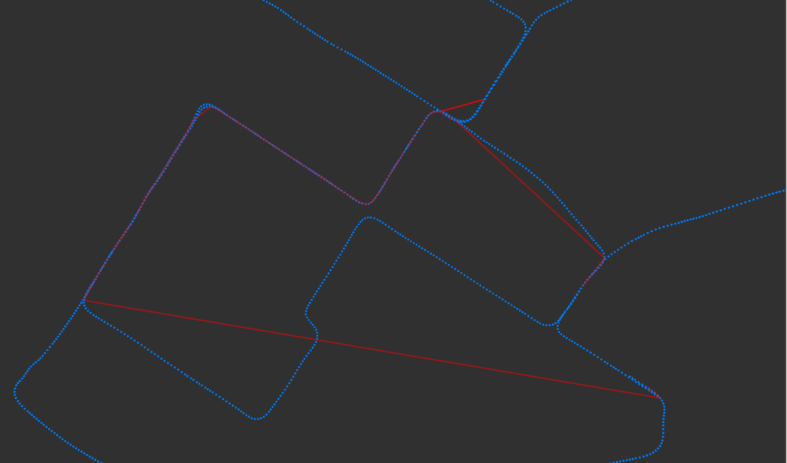
  
  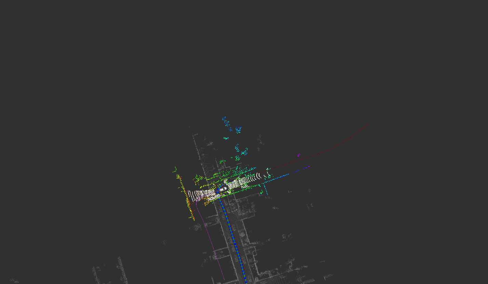

## Dependency

- [GTSAM](https://github.com/borglab/gtsam/releases)(最好采用4.0.0-alpha2版本)

## Usage

### Run the package

1. Run the launch file:

```shell
roslaunch xchu_mapping  xchu_mapping.launch 
```

2. 测试数据采用kitti 00 序列，以改成离线系统，bag包播放速度无所谓。

```shell
rosbag play kitti_2011_10_03_drive_0027_synced.bag --clock
```

   3.保存地图到xchu_mapping/pcd中。关闭终端会在pcd文件夹中生成tum格式的pose数据odom_tum.txt，可以利用evo工具计算其RPE和APE误差。

```bash
rosservice call /save_map
```

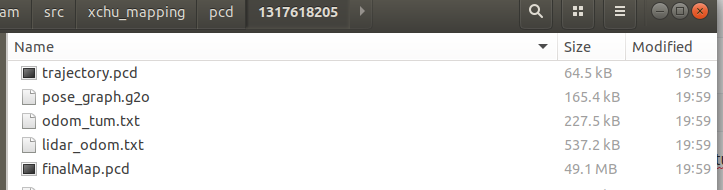

### 性能及实验

在KITTI 00上序列上进行测试，需要将ground truth拷贝到文件夹下，安装evo工具，并将KITTI gt转换为TUM格式。在PCD文件夹下已经给出了本人的默认配置的实验结果，可以直接跑。

- 里程计轨迹评估（加GPS）：APE 9.15m

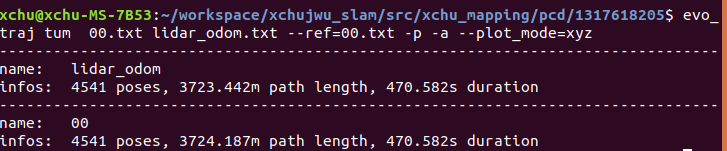

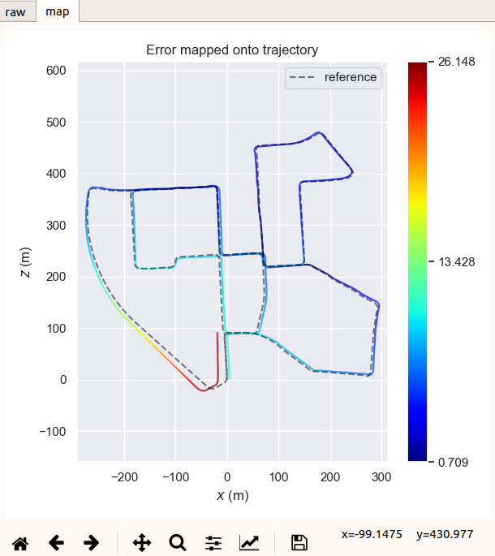

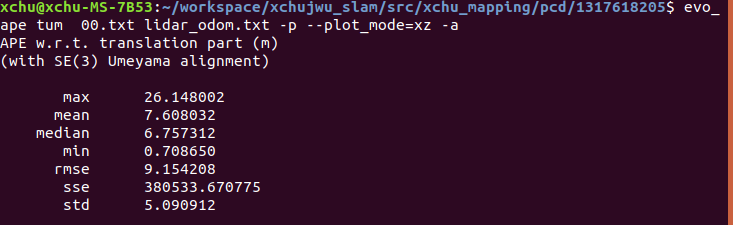

- 优化后的EVO轨迹评估，漂移约8.2m/3724.187m

```sh
evo_traj tum  00.txt odom_tum.txt --ref=00.txt -p -a --plot_mode=xyz
```

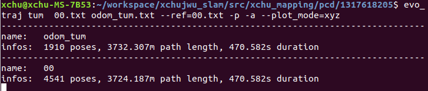

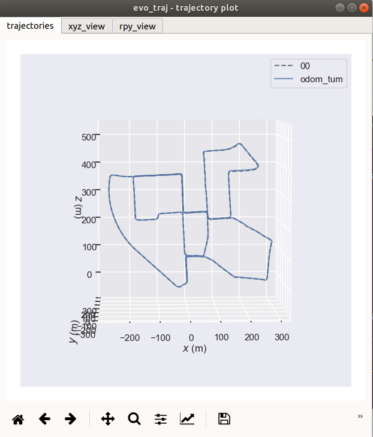

**因子图不加GPS**

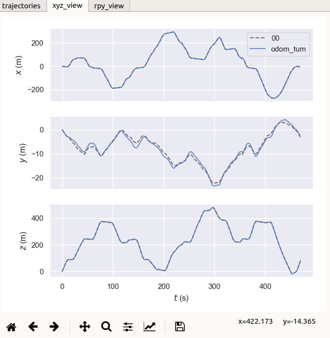

**因子图加入GPS**

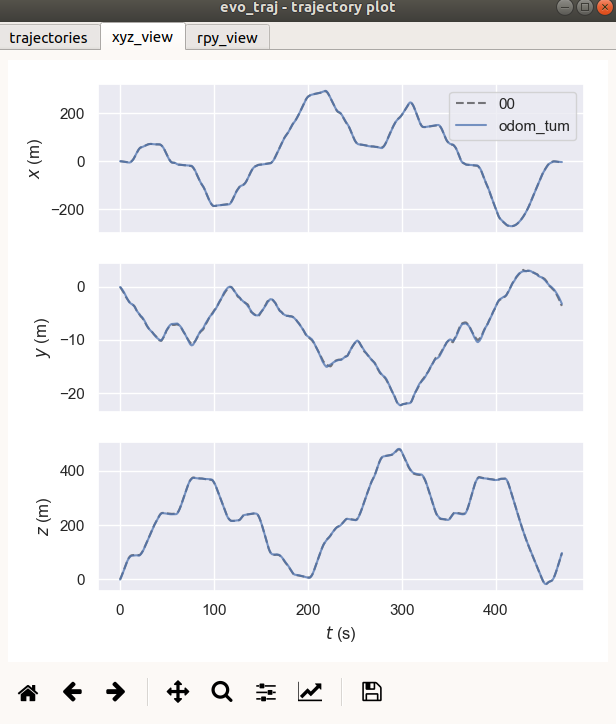

- 优化后的，EVO APE评估，RMSE为1.25m 

```sh
evo_ape tum  00.txt odom_tum.txt -p --plot_mode=xz -a 
```

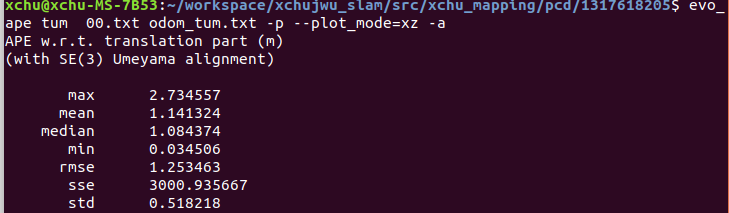

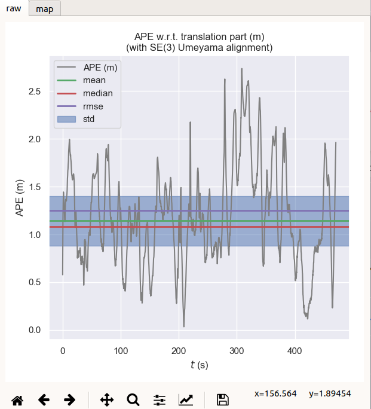

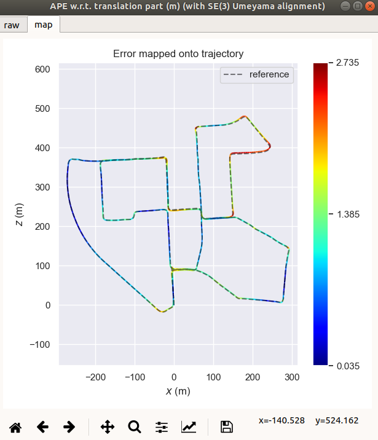

- 优化后的EVO RPE评估，RMSE 3.405m
```sh
evo_rpe tum  00.txt odom_tum.txt -p --plot_mode=xz -a 
```

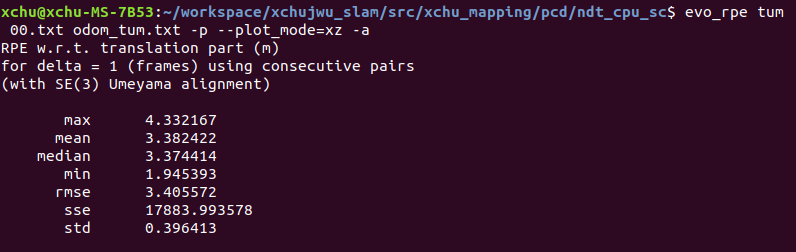

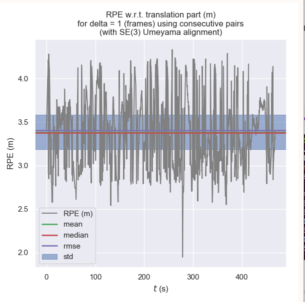

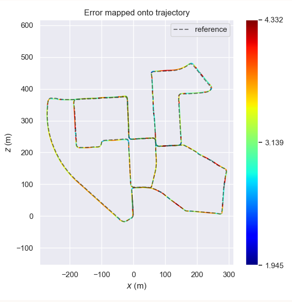

### 效果图

下图是优化后的kitti轨迹

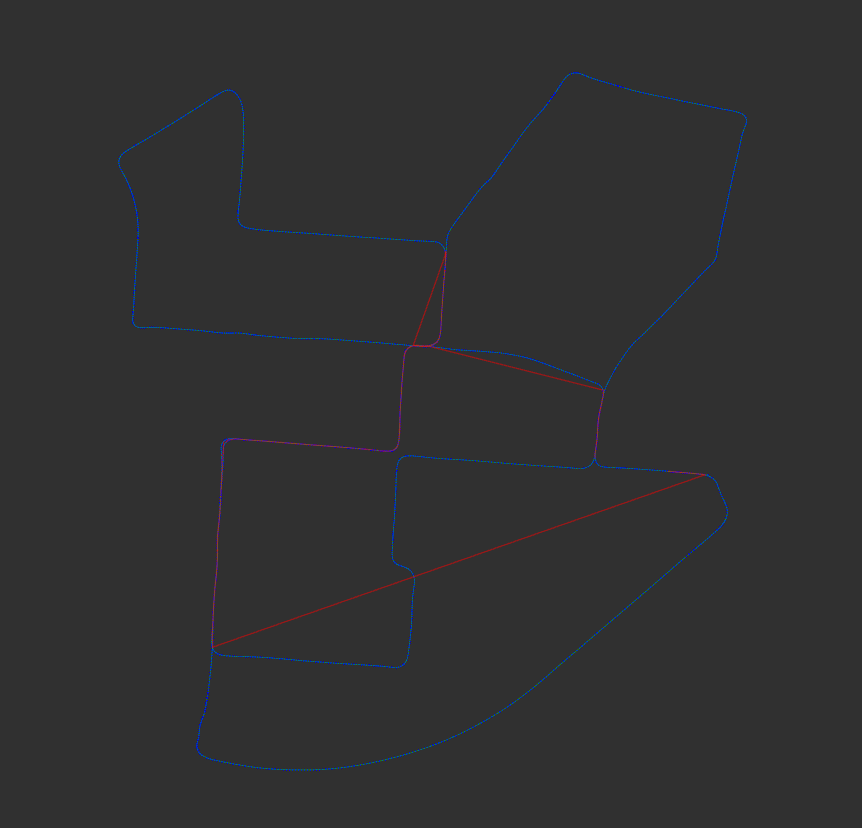

高度上偏移纠正回来了。

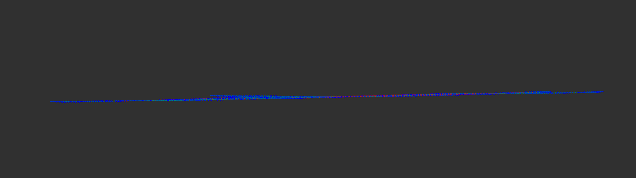

### Reference

- **LEGO-LOAM/SC-LEGO LOAM**
- **HDL-Graph SLAM**
- **Intensity Scan context/ISC LOAM**
- **SCAN CONTEXT**
- **LIO SAM**
- **AUTOWARE**
- **NDT_OMP**

